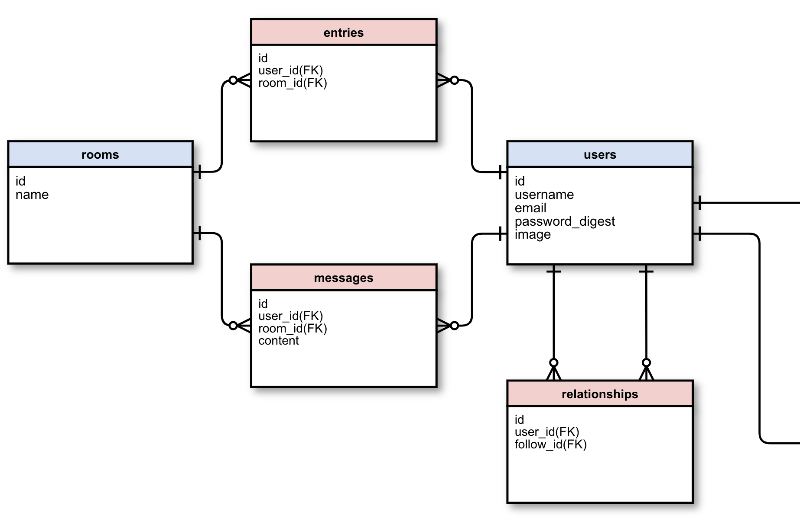
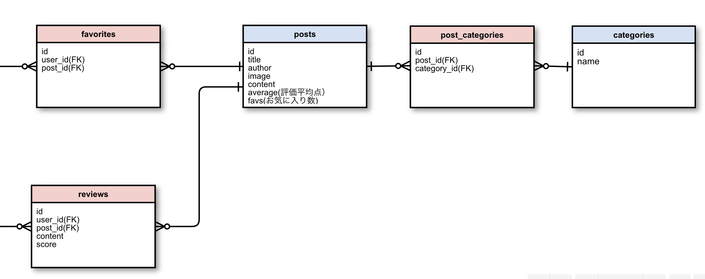

# Find Book

## 概要
読みたい漫画などの書籍を見つけるためのアプリです。 
ジャンルやキーワードで条件検索し、5段階評価をすることができます。 
その他にもユーザーをフォローし、メッセージのやり取りなどSNSとしての側面もあります。

## デプロイ
https://find-book-0605.herokuapp.com/

## 開発環境
* Ruby 2.5.3
* Ruby on Rails 5.2.4
* Mysql 5.5.62
* javascript
* jQuery
* Bulma
* AmazonS3

## 機能
<h4> ・条件検索機能 </h4>

 
<h4> ・評価・コメント機能 </h4>

 
<h4> ・検索ソート機能 </h4>

 
<h4> ・ユーザー登録機能 </h4>

 
<h4> ・フォロー・アンフォロー機能 </h4>

 
<h4> ・メッセージ機能 </h4>

 
<h4> ・お気に入り機能 </h4>

 

## ER図
<h4> ER図１ </h4>

<h4> ER図2 </h4>

## インストール
$ git clone https://github.com/yukimimura/find-book.git 
$ bundle install 
$ rails db:create 
$ rails db:migrate 
$ rails s
